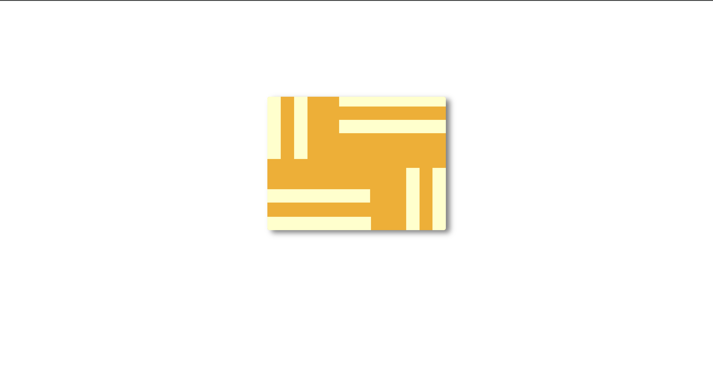

<h1>Yellow Maze Challenge</h1>

<h2>Table of Contents</h2>
<ul>
    <li><a href="#introduction">Introduction</a></li>
    <li><a href="#challenge-description">Challenge Description</a></li>
    <li><a href="#purpose">Purpose</a></li>
    <li><a href="#prerequisites">Prerequisites</a></li>
    <li><a href="#file-structure">File Structure</a></li>
    <li><a href="#tools-used">Tools Used</a></li>
    <li><a href="#preview">Preview</a></li>
    <li><a href="#contributing">Contributing</a></li>
    <li><a href="#credits">Credits</a></li>
</ul>

<h2 id="introduction">Introduction</h2>

The Yellow Maze challenge is a CSS layout task designed to create a maze-like structure using basic HTML and CSS. This challenge is part of a series that aims to improve CSS layout and positioning skills.

<h2 id="challenge-description">Challenge Description</h2>

This challenge involves creating a maze layout using div elements and CSS properties. The goal is to practice positioning and layering elements to form a visually appealing and structured design.

<h2 id="purpose">Purpose</h2>

The primary purpose of this challenge is to:

<ul>
    <li>Enhance skills in CSS layout techniques.</li>
    <li>Practice the use of absolute and relative positioning.</li>
    <li>Improve understanding of CSS properties such as <code>background-color</code>, <code>box-shadow</code>, and <code>border-radius</code>.</li>
</ul>

<h2 id="prerequisites">Prerequisites</h2>

Before attempting this challenge, you should have a basic understanding of:

<ul>
    <li>HTML structure</li>
    <li>CSS properties and selectors</li>
    <li>CSS positioning techniques</li>
</ul>

<h2 id="file-structure">File Structure</h2>
<pre>
Yellow-Maze/
│
├── index.html
└── styles.css
</pre>

<h2 id="tools-used">Tools Used</h2>

The following tools were used in this challenge:

<ul>
    <li>A code editor (e.g., VSCode)</li>
    <li>A web browser for viewing the demo</li>
</ul>

<h2 id="preview">Preview</h2>

Live Demo: <a href="https://codepen.io/Yashi-the-lessful/pen/MWdNwvd" target="_blank">Yellow Maze on CodePen</a>

<h2 id="credits">Credits</h2>

This challenge was inspired by the CSS Battle challenge, which can be found <a href="https://cssbattle.dev/play/fQLj0ZRJsJD5jsCq7XLA" target="_blank">here</a>.
